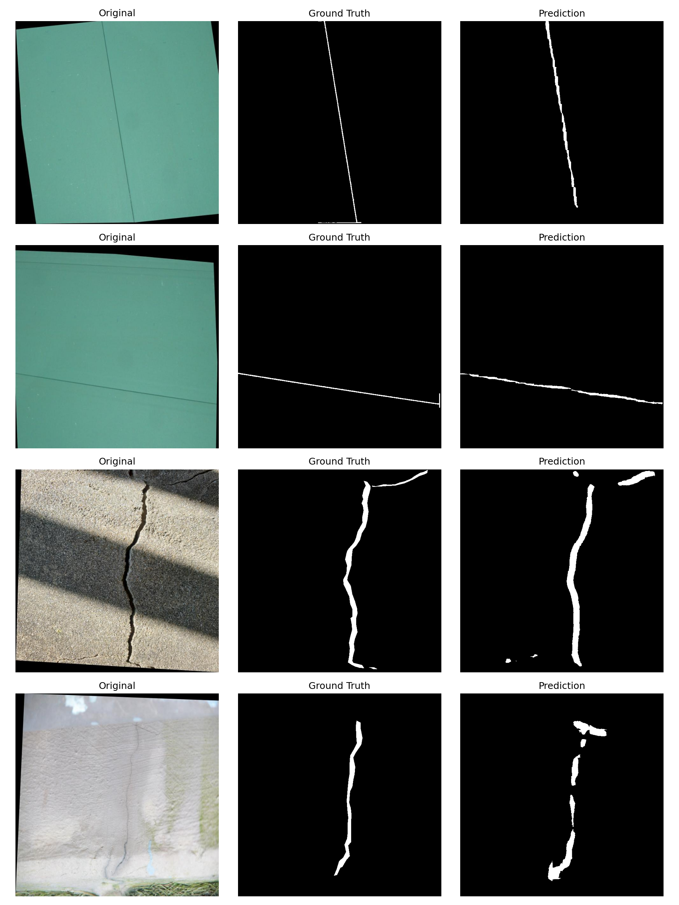

# Prompted Segmentation for Cracks and Drywall QA

## 📌 Goal Summary
The objective of this project is to fine-tune a text-conditioned segmentation model that can accurately isolate structural defects and features in images. Given an image and a natural-language prompt, the model produces a pixel-perfect binary mask for two specific targets:
* **"segment crack"** (Dataset 2: Cracks)
* **"segment taping area"** (Dataset 1: Drywall-Join-Detect)

---

## 🗄️ Datasets & Splits
The project utilizes two datasets sourced from Roboflow Universe. To ensure high-quality training, a custom data engineering pipeline was applied to generate precise ground truth masks.

| Dataset | Target Prompt | Train Split | Validation Split |
| :--- | :--- | :--- | :--- |
| **Dataset 1 (Drywall)** | `"segment taping area"`, `"segment joint/tape"` | 820 | 202 |
| **Dataset 2 (Cracks)** | `"segment crack"`, `"segment wall crack"` | 4,294 | 1,074 |
| **Total** | | **5,114** | **1,276** |

---

## 🚀 Approach & Model
### Base Model
* **Model Tried:** `CIDAS/clipseg-rd64-refined` (CLIPSeg)
* **Reasoning:** Chosen for its native ability to perform text-conditioned image segmentation without requiring extensive architectural modifications.

### Ground Truth (GT) Generation Pipeline
* **Cracks (Dataset 2):** Original labels were provided as high-fidelity polygon coordinates. These were directly mapped onto a zero-matrix to produce pixel-perfect binary masks (0 or 255).
* **Drywall Taping Area (Dataset 1):** Original labels were wide YOLO bounding boxes. Training on massive boxes would lead to a "Mathematical Crash" in mIoU. To extract the actual thin seam, a traditional CV pipeline was applied within the bounding box ROI:
  1. *Canny Edge Detection* (to find high-contrast seams)
  2. *Border Suppression* (to remove artificial cropping borders)
  3. *Morphological Closing* (to bridge fragmented line segments)
  4. *Geometric Filtering* (filtering by aspect ratio to keep only elongated thin lines)

### Training Strategy
* **Loss Function:** A hybrid **BCE + Dice Loss**. BCE stabilized the pixel-level classification, while Dice Loss was critical for managing the extreme class imbalance (thin lines vs. massive background).

### Detailed Methodology

The project employs a comprehensive methodology combining advanced machine learning with traditional computer vision techniques to achieve accurate text-conditioned segmentation for drywall inspection and crack detection.

#### Text-Conditioned Segmentation with CLIPSeg
CLIPSeg leverages the power of vision-language models by conditioning segmentation on natural language prompts. This allows the model to understand and isolate specific features described in text, such as "segment crack" or "segment taping area", without requiring task-specific architectures. The model processes images and text inputs jointly, producing segmentation masks that align with the semantic content of the prompts.

#### Data Engineering for Ground Truth Masks
Accurate ground truth is crucial for training robust segmentation models. The project implements specialized pipelines for each dataset to generate high-quality binary masks:

- **Crack Segmentation Masks:** Starting from polygon annotations that outline crack boundaries, the pipeline converts these geometric shapes into pixel-level binary masks. This direct mapping ensures that the masks precisely represent the irregular, often thin crack patterns in walls.

- **Drywall Taping Area Masks:** The original dataset provides bounding boxes around potential taping areas. To extract the actual thin joint seams, a multi-stage computer vision approach is used:
  - Edge detection techniques identify high-contrast boundaries within the regions of interest.
  - Morphological operations connect fragmented segments and remove noise.
  - Geometric constraints filter contours to retain only elongated, thin structures typical of drywall seams.
  - This results in precise masks that focus on the narrow taping lines rather than large background areas.

#### Training and Optimization
The training process incorporates several strategies to maximize performance:
- **Prompt Augmentation:** Multiple synonymous prompts are used during training to improve model generalization and robustness to varied phrasings.
- **Hybrid Loss Function:** Combining Binary Cross-Entropy for pixel-wise accuracy with Dice Loss for handling class imbalance ensures stable convergence and accurate segmentation of thin structures.
- **Early Stopping:** Monitors validation loss to prevent overfitting, automatically halting training when no improvement is observed for several epochs.
- **Reproducibility:** Fixed random seeds across all computational components ensure consistent results across runs.

#### Evaluation Framework
Comprehensive evaluation uses standard segmentation metrics:
- **Mean Intersection over Union (mIoU):** Measures the overlap between predicted and ground truth masks, providing a strict accuracy assessment.
- **Dice Coefficient:** Evaluates the similarity between predicted and true regions, particularly effective for imbalanced datasets.
- **Per-Class and Overall Metrics:** Separate evaluation for each target class allows identification of specific strengths and weaknesses.

This methodology integrates cutting-edge AI with classical image processing to deliver a reliable solution for automated drywall inspection, capable of detecting both visible cracks and subtle joint imperfections.

---

## 📊 Evaluation Metrics
The model was evaluated on the held-out validation set (`n=1,276`) using Mean Intersection over Union (mIoU) and the Dice Coefficient.

| Category | mIoU | Dice Score | Samples (n) |
| :--- | :--- | :--- | :--- |
| **Drywall (Taping Area)** | 0.2581 | 0.3717 | 202 |
| **Cracks** | 0.5437 | 0.6884 | 1,074 |
| **Overall** | **0.4009** | **0.5301** | **1,276** |

---

## 🖼️ Visual Examples

---

## ⚠️ Brief Failure Notes
The primary bottleneck remains the **Drywall (Taping Area)** segmentation. While the refined ground truth masks are pixel-perfect thin lines, the `clipseg-rd64-refined` model utilizes a coarse internal spatial resolution 